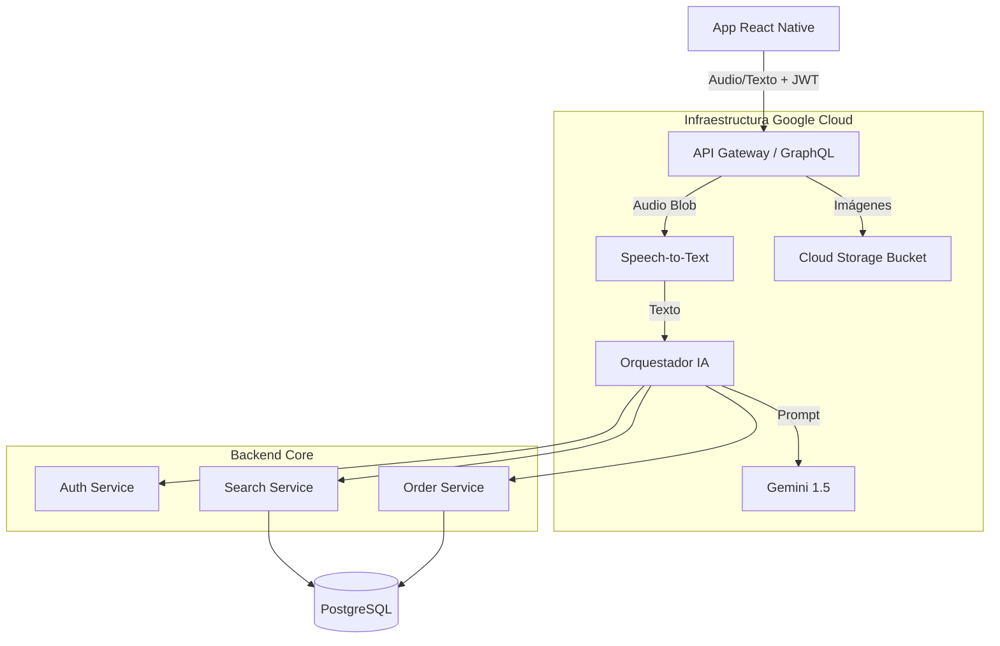

# PROYECTO: Sistema Agéntico de Comercio Inteligente (Sales AI MVP)

## 1. Visión del Proyecto

Desarrollar una plataforma de comercio electrónico "Voice-First" asistida por Inteligencia Artificial Generativa. El sistema actúa como un **Vendedor Experto** capaz de escuchar al usuario a través de una App Móvil, entender su estilo de comunicación (jerga, formalidad) y guiar la venta a través de un flujo estructurado: desde el descubrimiento del producto hasta la confirmación transaccional segura.

---

## 2. Requerimientos Funcionales (MVP Completo)

### A. Backend & IA (El Cerebro)

1. **Reconocimiento de Voz (STT):** Integración con **Google Cloud Speech-to-Text**. El backend recibe audio (blob) y devuelve texto transcribido.
2. **Personalización Dinámica:** El sistema detecta el "Vibe" del usuario (ej: Cuencano, Formal, Juvenil) y adapta el tono de "Alex" en tiempo real.
3. **Arquitectura Multi-Agente:**
    * *Agente Buscador:* Recuperación rápida de candidatos (SQL).
    * *Agente Vendedor:* Persuasión y filtrado (LLM).
    * *Agente Cajero:* Confirmación y cierre (Lógica Dura).

### B. Gestión de Datos e Infraestructura

1. **Autenticación Segura:** Login y registro de usuarios mediante **JWT**.
2. **Gestión de Media:** Almacenamiento de fotos de productos en **Google Cloud Storage (Buckets)**.
3. **Persistencia Transaccional:** Sistema de pedidos normalizado (Cabecera + Detalles).

### C. Frontend Móvil (La Cara)

1. **App Nativa:** Desarrollada en **React Native (Expo)**.
2. **Interfaz de Chat:** UI conversacional fluida (Texto y Voz).
3. **Grabación de Audio:** Funcionalidad "Push-to-Talk" para enviar notas de voz al agente.

---

## 3. Arquitectura Técnica

### Stack Tecnológico Actualizado

* **Frontend:** React Native (Expo) + Apollo Client (GraphQL).
* **Backend:** Python FastAPI + Strawberry GraphQL.
* **Base de Datos:** PostgreSQL 15.
* **Cache:** Redis (Historial de chat y sesiones).
* **Infraestructura Cloud (GCP):**
  * *IA:* Vertex AI (Gemini 1.5 Flash).
  * *Voz:* Cloud Speech-to-Text API.
  * *Archivos:* Cloud Storage (Buckets).

### Diagrama de Flujo de Datos

---

## 4. Modelo de Datos (Esquema Relacional)

Se normaliza la estructura de pedidos para soportar análisis futuro.

### Tabla: `users`

* `id`: UUID (PK)
* `email`: String (Unique)
* `password_hash`: String
* `full_name`: String
* `phone`: String
* `communication_style`: String (Cache del estilo detectado)

### Tabla: `product_stocks`

* ... (Campos existentes)
* `image_url`: String (Link público al Bucket de GCP)
* `category`: String (Para facilitar filtros del Agente 1)

### Tabla: `orders` (Cabecera)

* `id`: UUID (PK)
* `user_id`: UUID (FK -> users)
* `status`: Enum (DRAFT, CONFIRMED, PAID, CANCELLED)
* `total_amount`: Decimal
* `created_at`: Datetime
* `shipping_address`: Text

### Tabla: `order_details` (Detalle)

* `id`: UUID (PK)
* `order_id`: UUID (FK -> orders)
* `product_id`: UUID (FK -> product_stocks)
* `quantity`: Integer
* `unit_price`: Decimal (Precio congelado al momento de compra)
* `subtotal`: Decimal (quantity * unit_price)

---

## 5. Hoja de Ruta de Implementación (Roadmap MVP)

### FASE 1: Cimientos y Datos (Backend)

* [ ] **Modelado de Datos:** Crear modelos SQLAlchemy para `User`, `Order` y `OrderDetail`.
* [ ] **Autenticación:** Implementar endpoints de `login` y `register` generando tokens JWT.
* [ ] **Seguridad GraphQL:** Crear middleware para proteger las rutas (solo usuarios logueados pueden comprar).
* [ ] **Infraestructura GCP:**
* Crear Proyecto en Google Cloud.
* Habilitar API Speech-to-Text.
* Crear Bucket público para imágenes (`gs://sales-agent-images`).

* [ ] **Seed Data:** Llenar la base con usuarios de prueba y productos con URLs de imágenes reales.

### FASE 2: Lógica Agéntica Avanzada (Backend)

* [ ] **Refactor de Pipeline:** Separar `SearchService` en:

1. `RetrieverTool` (Búsqueda SQL rápida).
2. `SalesAgent` (LLM con personalidad).

* [ ] **Style Matcher:** Crear función que analice los últimos 5 mensajes y defina el `system_prompt` dinámico.
* [ ] **Motor de Pedidos:** Crear la lógica para pasar de "Carrito temporal" a insertar en `orders` y `order_details`.
* [ ] **Integración STT:** Crear servicio Python que reciba bytes de audio y retorne texto usando Google Cloud.

### FASE 3: Desarrollo App Móvil (Frontend)

* [ ] **Setup React Native:** Inicializar proyecto con Expo (`npx create-expo-app`).
* [ ] **Cliente GraphQL:** Configurar Apollo Client con el token JWT en los headers.
* [ ] **Pantallas Base:** Login, Chat Principal, Lista de Productos (Catálogo visual).
* [ ] **Grabación de Voz:** Implementar `expo-av` para grabar audio y enviarlo al backend como `multipart/form-data`.
* [ ] **Renderizado de Chat:** Mostrar mensajes de texto, imágenes de productos y botones de acción ("Comprar").

### FASE 4: Optimización y Cierre

* [ ] **Redis Cache:** Implementar caché para queries de productos frecuentes (evitar ir a la DB siempre).
* [ ] **Testing de Flujo:** Probar el ciclo completo: Voz -> Texto -> Búsqueda -> Persuasión -> Compra -> DB.
* [ ] **Demo Final:** Script de demostración con casos de uso variados (usuario indeciso, usuario directo, usuario con jerga).
